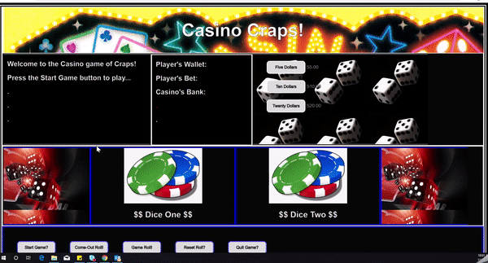

## Craps - The Casino Game!

This is a basic game of Craps.

## Motivation

New to JavaScript and needed a project to work on. 

## Build status

Works, but needs a face-lift, and some updating. 

## Screenshots

## Tech/Framework

Visual Studio Code, HTML 5, CSS, JavaScript

## Installation

Download files.

## How to use?

This project is a very simple button driven program. Just follow the dialog text in the left panel. There is also red text button message that explains which buttons to click on next located in the center panel. 
Some of the buttons have been placed inactive to reduce selection to the correct button choice that's needed during the game. Viewed best on large monitor, use Chrome or FireFox browser.

1. Start Game button (Welcome)
2. Then place a bet using the Dollars, or betting buttons in the right panel.  (Place a Bet)
3. Then click on the 'Come-Out Roll' button. If you win, on the 'Come-Out' Roll, you will need to "Reset Roll" and a new Come Out Roll begins, requiring a new bet. (First Roll)
4. The Game Roll button is used on any other roll that is not the first roll on a new bet. (Next Roll)
5. The Reset Roll is used anytime you win or lose a bet, remember to place a new bet and then use the 'Come-Out Roll' button.
6. Quit Game just resets the browser and clears the game.

## Credits

Special Thanks to:

Steve Bourie at the americancasinoguide channel YouTube https://www.youtube.com/watch?v=7daSiVupvmY https://www.youtube.com/watch?v=QtPcd_UURp0
Wikipedia 'Craps'  https://en.wikipedia.org/wiki/Craps 
How Stuff Works https://entertainment.howstuffworks.com/playing-craps.htm

## License

It probably doesn’t need any kind of licensing, but in keeping with GitHub’s preferred practices and recommendations. I have placed this under the provisions and guidelines of an MIT License. 
MIT © [Gilbert Gonzales]()

