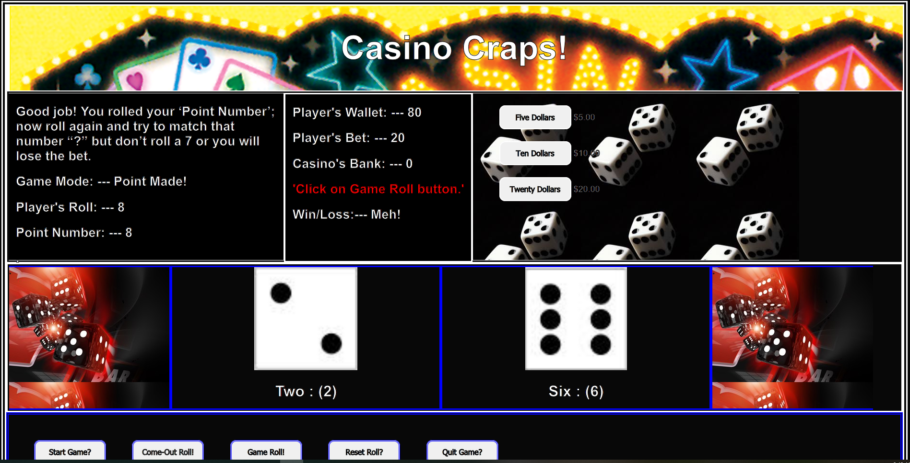

## Craps - The Casino Game!

This is a very basic first attempt at the game of **Craps**. It uses buttons, Text display and very simplified game rule set. 
The betting process has been dumbed down a bit, I am considering another project that will focus more on the Craps Board and the betting that this provides. 
But that will be a much bigger project to cut some teeth on, for a later date. 

## Motivation

I am new to ‘JavaScript’, and I needed a project to cut some teeth on. Games seem to be a great way to learn programming by providing the some practical and logical problem solving opportunities. 
I thought a dice game with two dice, how hard can that be?  It turns out that this is a very exciting game of chance, with many moving parts. As mentioned earlier, the **betting portion** alone is a project in itself. 

## Build status

Just remember I am a newbie to this stuff. Currently this is the first upload and there is definitely room for some improvement. 

## Code style

HTML 5, CSS, JavaScript  
 
## Screenshots

## Tech/framework used

(IDE) Used for this project was 'Visual Studio Code'.

## Installation

Download files, make certain that images are in a folder named 'Images'

## How to use?

This project is a very simple button driven program. Just follow the dialog text in the left panel. There is also red text button message that explains which buttons to click on next located in the center panel. 
Some of the buttons have been placed inactive to reduce selection to the correct button choice that's needed during the game.

1. Start Game button (Welcome)
2. Then place a bet using the Dollars, or betting buttons in the right panel.  (Place a Bet)
3. Then click on the 'Come-Out Roll' button. If you win, on the 'Come-Out' Roll, you will need to "Reset Roll" and a new Come Out Roll begins, requiring a new bet. (First Roll)
4. The Game Roll button is used on any other roll that is not the first roll on a new bet. (Next Roll)
5. The Reset Roll is used anytime you win or lose a bet, remember to place a new bet and then use the 'Come-Out Roll' button.
6. Quit Game just resets the browser and clears the game.

## Credits

Special Thanks to:

Steve Bourie at the americancasinoguide channel YouTube https://www.youtube.com/watch?v=7daSiVupvmY https://www.youtube.com/watch?v=QtPcd_UURp0
Wikipedia 'Craps'  https://en.wikipedia.org/wiki/Craps 
How Stuff Works https://entertainment.howstuffworks.com/playing-craps.htm

## License

This is a pretty raw and simple program, if you are new to JavaScript like I am feel free to take a look at this and use it. If you are student this may help you out, review it, rewrite it, and have fun with it. I have placed this under the provisions and guidelines of MIT License. 

MIT © [Gilbert Gonzales]()
